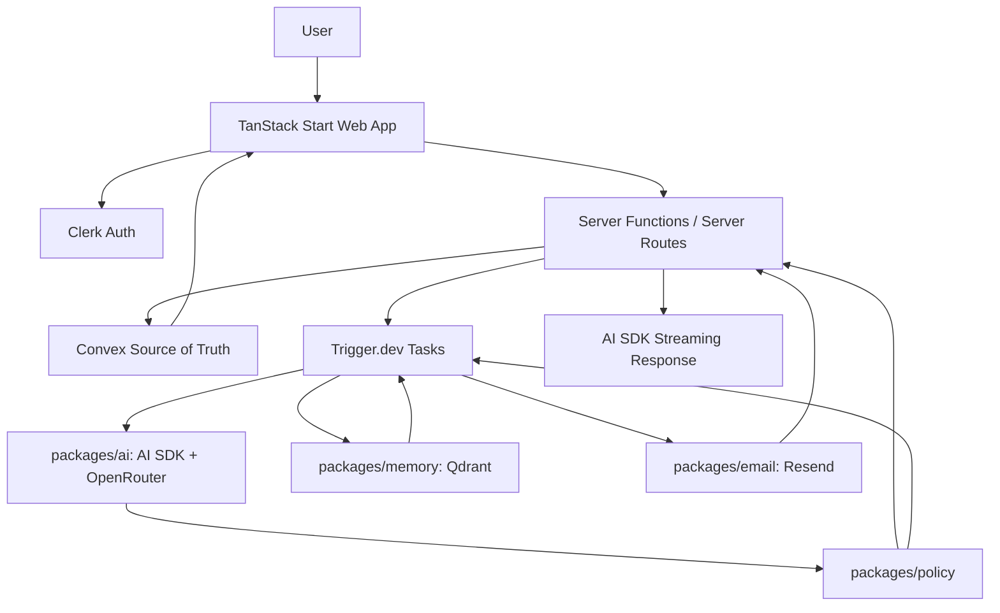

# System Overview

## Mental Model

TanStack Start is the user interface and thin server glue. Clerk is identity. Convex is the source of truth. Trigger.dev is the reliable background workflow system. Qdrant is the semantic memory index. OpenRouter plus AI SDK is the model layer. Resend is the email loop. The policy engine controls what the assistant may do.

## Request Classes

### Fast User Requests

Examples: create journal entry, edit memory, search dashboard, approve candidate memory.

Path:

```text
Browser -> TanStack Start Server Function -> auth + schema validation -> Convex mutation/query -> optional Trigger.dev task -> response
```

Rule: return quickly. Do not run long AI work in the request.

Chat-powered management uses the same path as dashboard mutations: classify intent, validate through schemas/settings registry, check policy, write through Convex, and audit the change.

### External Webhooks

Examples: Resend inbound email and other verified external callbacks added later.

Path:

```text
External service -> TanStack Start Server Route -> signature/auth verification -> parse minimal payload -> Convex raw event/source -> Trigger.dev task -> 2xx response
```

Rule: verify the webhook and enqueue work. Do not parse large documents or run memory extraction inside the webhook request.

### Long Workflows

Examples: memory extraction, embeddings, profile refresh, weekly summary, reminder sends.

Path:

```text
Trigger.dev task -> Convex reads/writes -> packages/ai -> packages/memory/Qdrant -> packages/email/Resend -> Convex audit logs
```

Rule: every task includes `tenantId`, `userId`, idempotency, logs, and failure handling.

## Mermaid System Sketch



## Core Invariant

Every action begins with an authenticated or securely matched user identity:

- Browser requests use Clerk session.
- Convex functions use authenticated identity or trusted internal calls with explicit `userId`.
- Inbound emails use verified Resend webhook plus signed reply token.
- Trigger.dev payloads carry `tenantId`, `userId`, and source IDs.
- Qdrant searches use the central filter builder and include hard `tenantId`, `userId`, status, visibility, and relevant time filters.

The first live user may be the creator, but the system is designed as paid multi-user SaaS infrastructure from the start.
